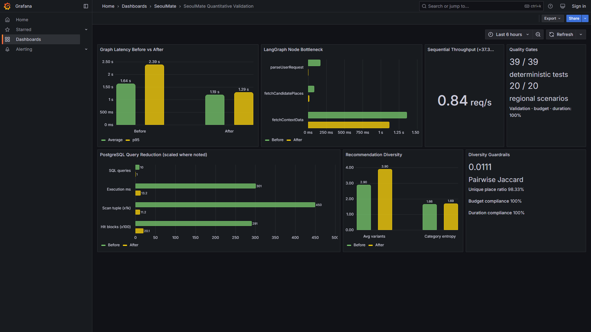
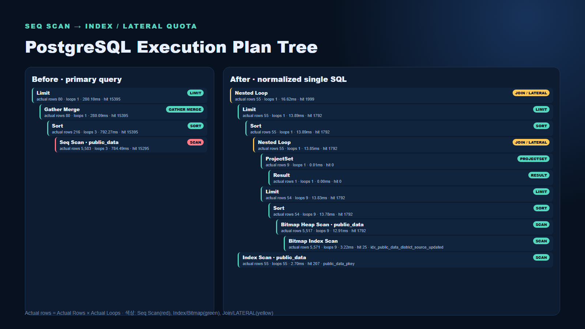
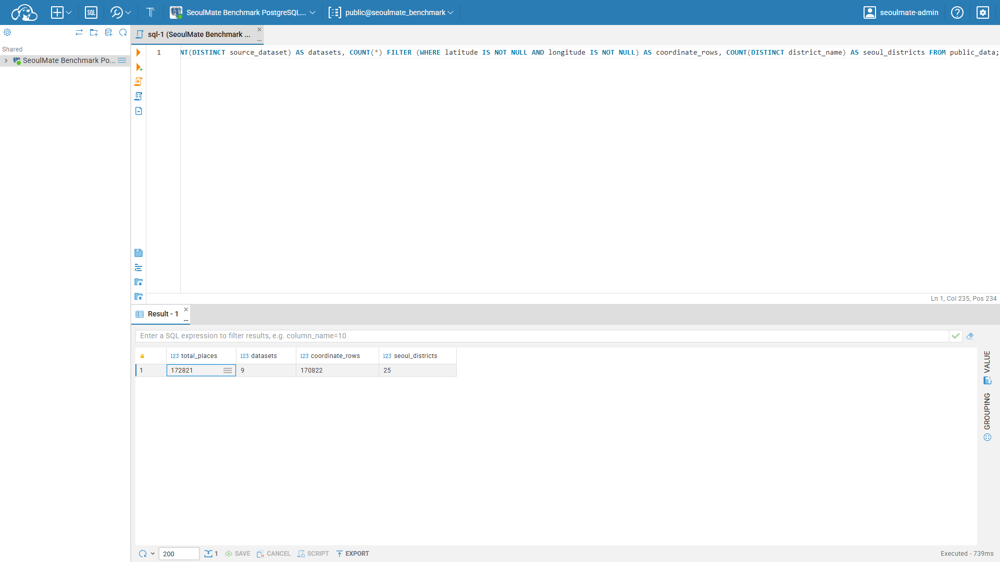
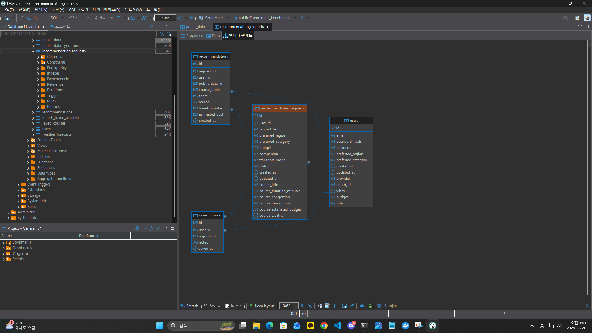
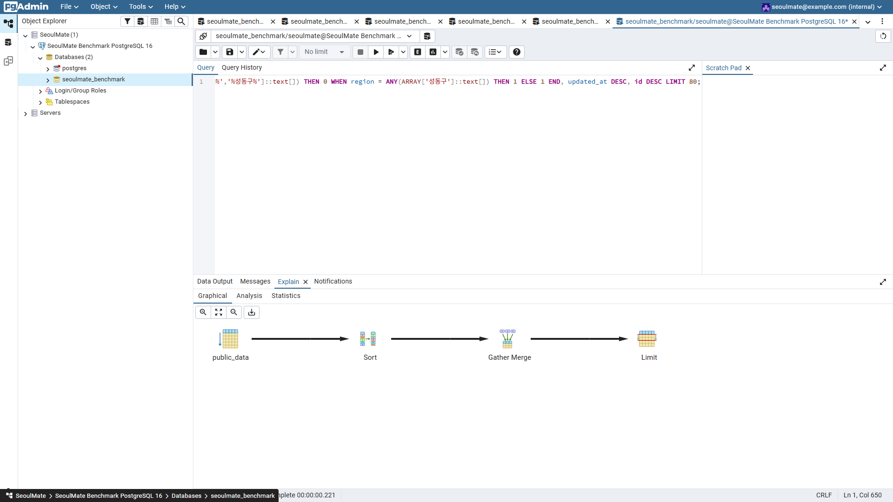
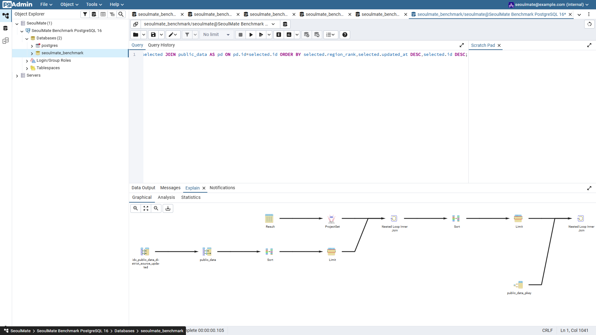

# SeoulMate Backend

> 자연어 한 문장을 실제 방문 가능한 서울 데이트 코스로 바꾸는 데이터 기반 추천 백엔드


## 프로젝트 소개

SeoulMate는 사용자가 “오늘 저녁 성수에서 4만 원 이하로 조용한 데이트 코스 추천해줘”처럼 자연어로 조건을 입력하면 서울시 공공데이터에 등재된 실제 장소만 조합해 코스를 만드는 서비스다.

LLM에게 장소 선택 전체를 맡기지 않았다. LLM은 모호한 문장을 구조화하고 결과를 자연스럽게 설명하는 역할에 집중한다. 실제 장소의 존재 여부, 예산, 영업 맥락, 날씨, 혼잡도, 이동 거리와 코스 순서는 PostgreSQL 데이터와 외부 검증, 결정론적 scoring으로 처리했다. 이 설계로 생성형 AI의 장점은 활용하면서도 존재하지 않는 장소를 추천하는 hallucination과 동일 요청의 결과가 과도하게 흔들리는 문제를 줄였다.

| 항목             | 내용                                                                          |
| ---------------- | ----------------------------------------------------------------------------- |
| 형태             | 팀 프로젝트, 백엔드·데이터·인프라 중심                                        |
| 핵심 기능        | 인증, 공공데이터 적재, 자연어 코스 추천, 장소 검색, 코스 저장                 |
| Backend          | Node.js 20, TypeScript, Express 5                                             |
| AI orchestration | LangGraph, OpenAI structured output                                           |
| Database         | PostgreSQL 16, AWS RDS                                                        |
| Infra            | AWS EC2, Nginx, PM2, GitHub Actions                                           |
| External API     | OpenAI, Kakao Local/Mobility, Kakao·Google OAuth, 서울 열린데이터광장, 기상청 |

## 해결하려던 문제

일반적인 장소 추천은 인기 장소 목록을 반환하는 데 그치기 쉽다. 실제 코스 추천은 다음 조건을 함께 해결해야 한다.

- 사용자의 모호한 자연어에서 지역, 시간, 예산, 분위기, 목적, 선호 카테고리를 추출해야 한다.
- 추천 장소가 실제로 존재하고 현재 활용할 수 있는 데이터인지 검증해야 한다.
- 개별 장소 점수뿐 아니라 장소 사이의 이동 거리와 방문 순서를 고려해야 한다.
- 날씨와 생활인구처럼 시점에 따라 달라지는 context를 반영해야 한다.
- 외부 API 하나가 실패해도 전체 추천 요청이 실패하지 않아야 한다.
- 추천 당시의 장소·가격·날씨를 저장해 상세 조회에서도 같은 결과를 보여줘야 한다.

이를 위해 추천을 단일 LLM prompt가 아닌 **해석 → 후보 조회 → 검증 → context 수집 → scoring → 코스 구성 → 검증 → 설명 → 저장** 파이프라인으로 설계했다.

## 담당 영역과 기여

- PostgreSQL 초기 schema와 공공데이터 적재 구조 설계
- 서울시 공공데이터 및 인허가 장소 데이터 연동
- 기상청 예보와 서울 생활인구 수집·조회 pipeline 구현
- 누락 좌표 탐지, 주소 기반 좌표 복구, 카테고리 정규화 구현
- Kakao 장소 검증, 카테고리 보강, URL matching 구현
- 지역·예산·분위기·혼잡·날씨·거리·안전·목적 기반 scoring 설계
- 이동 거리와 role 순서를 반영한 코스 및 최대 4개 variant 구성
- 외부 API timeout/rate limit에 대한 fallback 설계
- 추천 결과와 장소·가격·날씨 snapshot 저장
- EC2/RDS/Nginx/PM2 구성과 GitHub Actions 배포 문서화

팀 단위로는 LangGraph 추천 workflow, 로컬·Kakao·Google 인증, JWT refresh rotation 및 HttpOnly cookie, CI/CD를 함께 완성했다.

## 전체 시스템 아키텍처

현재 운영 구조는 EKS가 아니라 `EC2 + Nginx + PM2 + RDS`다.

```text
Client
  -> HTTPS / Nginx
  -> PM2 / Express
       -> Auth · User · Course API
       -> LangGraph recommendation workflow
       -> PostgreSQL repository
       -> OpenAI · Kakao · KMA · Seoul Open Data clients
  -> RDS PostgreSQL

GitHub main push
  -> GitHub Actions
  -> SSH deployment
  -> install · build · PM2 reload
```

애플리케이션 EC2는 서울 리전 `ap-northeast-2a`의 public subnet에 있고 RDS는 private DB subnet에 둔다. RDS subnet group은 `2a`, `2c`를 포함하지만 EC2 한 대와 RDS 한 대가 실행되는 현재 가용성은 Single-AZ다. 초기 서비스의 비용과 운영 난이도를 낮추는 대신, 앱과 DB를 분리하고 향후 ALB/Auto Scaling/RDS Multi-AZ로 확장할 수 있게 경계를 잡았다.

인프라의 구성, 포트, 보안 그룹, 배포와 trade-off는 [인프라 아키텍처 문서](SeoulMate_BE/docs/INFRASTRUCTURE.md)에 상세히 정리했다.

## 백엔드 구조

```text
HTTP Request
  -> routes
  -> controllers
  -> services / graphs
  -> repositories / clients
  -> PostgreSQL / external providers
```

- `routes`: URL과 인증·validation middleware 조합
- `controllers`: HTTP request/response mapping
- `services`: 인증, 추천, 공공데이터 domain logic
- `graphs`: 추천 과정의 상태와 단계 orchestration
- `repositories`: SQL과 transaction, persistence boundary
- `clients`: provider별 request/response 변환과 오류 격리
- `jobs`: 온라인 요청과 분리한 적재·정규화 batch

controller에서 외부 API나 SQL을 직접 호출하지 않아 provider 교체와 테스트 범위를 좁혔다.

## LangGraph 추천 엔진 구현

### LangGraph를 선택한 이유

추천 과정은 단일 함수로 구현하기에는 단계가 많고, 각 단계가 공유하는 상태와 실패 정책이 달랐다. LangGraph의 typed state와 node 조합을 사용해 다음 문제를 해결했다.

- 단계별 입력·출력과 책임을 명시한다.
- 중간 상태를 보존해 어느 단계에서 결과가 달라졌는지 추적한다.
- LLM 단계와 결정론적 단계를 분리한다.
- API용 경량 graph, 전체 graph, 설명 생략 graph를 같은 node로 조합한다.
- 검증 실패 시 대안 코스를 만든 뒤 재검증하는 흐름을 표현한다.

### Typed shared state

`Annotation.Root`로 graph state를 정의했다. 주요 상태는 다음과 같다.

| 상태                  | 의미                                  |
| --------------------- | ------------------------------------- |
| `rawInput`            | 사용자가 입력한 자연어 원문           |
| `parsedRequest`       | 지역·예산·시간·분위기·목적·카테고리   |
| `candidatePlaces`     | DB 조회와 Kakao 검증을 거친 장소 후보 |
| `contextData`         | 날씨·혼잡도·기준 좌표·경로 정보       |
| `scoredPlaces`        | 장소별 총점과 항목별 점수             |
| `course`              | 순서·이동 시간·비용을 포함한 코스     |
| `validation`          | 예산·장소 수·거리·날씨 조건 검증 결과 |
| `aiExplanation`       | 요약, 추천 이유, 위험 안내, 대안      |
| `finalRecommendation` | API 응답용 최종 형태                  |
| `warnings`, `errors`  | node가 누적하는 진단 정보             |

`warnings`와 `errors`에는 reducer를 설정해 node update가 기존 내용을 덮지 않고 누적되도록 했다. node는 전체 state를 직접 변경하지 않고 자신이 책임지는 부분만 partial update로 반환한다.

### 전체 graph

```text
START
  -> parseUserRequest
  -> fetchCandidatePlaces
  -> verifyCandidatePlaces
  -> fetchContextData
  -> scorePlaces
  -> buildCourse
  -> validateRecommendation
  -> buildAlternativeCourse
  -> validateRecommendationFinal
  -> generateAiExplanation
  -> generateRiskNotice
  -> formatRecommendationResult
  -> END
```

#### 1. `parseUserRequest`

자연어를 `ParsedRecommendationRequest`로 변환한다. OpenAI structured output으로 schema를 강제하고, API body에 명시된 값이 있으면 LLM 결과보다 우선한다. 상대 날짜는 KST 기준으로 보정한다. OpenAI 호출이 실패하면 keyword/정규식 기반 heuristic parser가 최소 조건을 복구한다.

```ts
interface ParsedRecommendationRequest {
  region?: string;
  budget?: number;
  dateTime?: string;
  durationHours?: number;
  mood?: string[];
  purpose?: string;
  preferredCategories?: string[];
}
```

#### 2. `fetchCandidatePlaces`

PostgreSQL `public_data`에서 지역, source dataset, 카테고리 조건으로 후보를 조회한다. 추천 대상은 사전에 적재된 실제 장소로 제한한다. 데이터셋 이름은 조회 범위를 정하는 데만 사용하고 장소 role 판별에는 정규화된 `placeFamily`를 우선한다.

#### 3. `verifyCandidatePlaces`

Kakao Local로 장소명, 주소, 좌표, 카테고리, URL을 교차 검증한다. confidence와 거리 정보를 state에 넣으며 provider timeout이나 quota 초과 시 검증 전 후보 전체를 폐기하지 않고 DB의 정규화 데이터를 사용한다.

#### 4. `fetchContextData`

후보의 중심 좌표 또는 지역 중심점을 기준으로 날씨, 기상 특보, 서울 생활인구 혼잡도와 장소 간 이동 context를 수집한다. Kakao route 정보가 없으면 좌표 거리로 이동 시간과 거리를 추정하고 `isFallback`을 남긴다.

#### 5. `scorePlaces`

장소 선택은 LLM의 주관적 순위가 아니라 동일 입력에 동일하게 계산되는 가중 점수를 사용한다.

```text
totalScore = region + budget + mood + crowd
           + weather + distance + safety + purpose
```

가중치는 `scoreWeight.ts` 한곳에서 관리한다. 응답에 `scoreDetail`을 보존해 추천 이유를 추적할 수 있고, 특정 정책의 가중치를 바꿀 때 영향 범위를 제한했다.

#### 6. `buildCourse`

요청 시간에 따라 1~8개 장소를 선택하고, 카페·식사·산책·문화·관광·활동 등 `CourseRole`의 순서와 중복 상한을 적용한다. 18시 이전과 이후의 기본 role 순서를 다르게 두며 nightlife는 사용자가 명시적으로 요청한 경우에만 포함한다. 장소 점수만 높은 조합이 아니라 이전 장소와 가까운 후보를 우선해 전체 동선을 줄인다.

#### 7. `validateRecommendation`

최소 장소 수, 예산 초과, 요청 지역 포함 여부, 과도한 이동 시간, 비 오는 날 야외 장소 포함 여부를 검사한다. 검증 결과는 boolean 하나가 아니라 error와 warning으로 분리한다.

#### 8. `buildAlternativeCourse`와 재검증

첫 결과에 치명적인 문제가 있으면 예산·거리·실내 조건을 더 보수적으로 적용한 대안 코스를 만든다. 이후 같은 validator를 `validateRecommendationFinal`로 다시 실행한다. 현재 graph는 node 구성을 단순화하기 위해 대안 node를 항상 지나가되, 교체가 필요하지 않으면 기존 결과를 유지한다.

#### 9. `generateAiExplanation`

확정된 코스만 LLM에 전달해 요약과 추천 이유를 생성한다. prompt는 전달받은 장소 외에 새로운 장소를 만들지 못하도록 제한한다. LLM 실패 시 지역, 예산, variant와 score detail을 이용한 template 설명을 반환한다.

#### 10. `generateRiskNotice`와 `formatRecommendationResult`

강수, 혼잡, 이동 정보 fallback, 예산 근접 등 사용자에게 필요한 주의사항을 생성한다. 마지막 node에서 내부 state를 외부 API response DTO로 변환해 graph 내부 진단 정보와 public contract를 분리한다.

### 세 종류의 graph 조합

동일한 node를 실행 목적에 맞게 세 가지 compiled graph로 구성했다.

| Graph                                        | 범위                     | 사용 목적                             |
| -------------------------------------------- | ------------------------ | ------------------------------------- |
| `runRecommendationGraph`                     | 해석부터 설명·format까지 | 단일 완성 코스 생성                   |
| `runRecommendationGraphWithoutAiExplanation` | 설명 node만 생략         | LLM 설명이 불필요한 처리              |
| `runRecommendationGraphForApi`               | parsing부터 scoring까지  | 여러 variant를 조립하는 API 공통 기반 |

API 경로는 공통 graph로 후보와 점수를 한 번 계산한 뒤 `best`, `balanced`, `indoor`, `low-budget`, `mood-*` variant를 만든다. variant별 설명은 병렬로 생성하되 하나의 설명 호출 실패가 다른 variant까지 취소하지 않도록 각각 fallback한다. 장소 중복이 50% 이상인 variant는 제거해 이름만 다른 동일 코스가 반환되지 않게 했다.

### AI 사용 경계

OpenAI는 두 곳에만 관여한다.

1. 자연어 요청을 typed 조건으로 변환
2. 이미 확정된 코스의 설명 생성

장소 존재 여부, 후보 조회, 점수, 예산, 이동 순서와 validation은 코드와 DB가 결정한다. 이 경계가 SeoulMate AI 설계의 핵심이다.

## 공공데이터 pipeline

```text
원본 API 수집
  -> schema normalization
  -> category / placeFamily 분류
  -> 좌표 검증 및 주소 기반 복구
  -> Kakao 장소·카테고리·URL matching
  -> PostgreSQL ON CONFLICT UPSERT
  -> 추천 후보 조회
```

온라인 추천 요청과 batch를 분리해 외부 공공 API latency와 장애가 사용자 요청에 직접 전파되지 않게 했다. 반복 실행 가능한 upsert를 사용하고 원본 source와 정규화 필드를 함께 보존해 데이터 lineage를 추적할 수 있다.

## 인증과 보안

- 로컬 로그인 비밀번호는 bcrypt hash로 저장한다.
- Kakao와 Google OAuth provider를 인증 domain 뒤에 격리했다.
- 짧은 수명의 access token과 rotation되는 refresh token을 사용한다.
- refresh token은 JavaScript에서 접근할 수 없는 HttpOnly cookie로 전달한다.
- 로그아웃·재사용 탐지 시 refresh token을 blacklist 처리한다.
- CORS는 허용된 frontend origin과 credentials 조합으로 제한한다.
- DB, JWT, OAuth, provider secret은 Git에 저장하지 않는다.

## Nginx와 PM2 운영 설계

### Nginx

Nginx가 80/443을 받고 Express는 `127.0.0.1:3000`에서만 실행된다. Nginx가 HTTPS redirect와 TLS termination, forwarded header, timeout, access log를 담당한다. 추천 API는 외부 provider를 호출하므로 일반 CRUD보다 긴 upstream timeout을 설정하되 무제한 연결은 허용하지 않는다.

이 구조의 장점은 애플리케이션이 인증서 파일이나 public socket 관리에 관여하지 않고 비즈니스 로직에 집중한다는 점이다. 3000 포트를 보안 그룹에 공개하지 않아 직접 접근도 차단한다.

### PM2

PM2는 컴파일된 `dist/server.js`를 `seoulmate-be`라는 이름으로 관리한다. 프로세스 예외 시 재시작하고, `pm2 startup`과 `pm2 save`로 EC2 재부팅 후에도 복원한다. 배포 시에는 `reload`를 사용해 단순 restart보다 중단 시간을 줄인다. PM2 log/status/monit는 초기 운영에서 빠른 장애 확인 지점을 제공한다.

PM2는 EC2 안의 process 장애만 복구한다. EC2 또는 AZ 장애를 해결하지 않으므로 고가용성 확장 시에는 ALB와 서로 다른 AZ의 복수 instance가 필요하다.

## CI/CD

`main` push를 기준으로 GitHub Actions가 SSH 배포를 수행한다.

```text
main push
  -> GitHub Actions runner
  -> EC2 SSH
  -> git clone 또는 origin/main 동기화
  -> npm install
  -> TypeScript build
  -> pm2 reload (없으면 start)
  -> pm2 save
```

EC2 host, user, private key는 GitHub Secrets로 관리한다. 이 방식은 소규모 서비스에서 구축과 장애 분석이 단순하다는 장점이 있다. 반면 artifact 불변성, 자동 rollback과 여러 instance 동시 배포는 부족하므로 트래픽 증가 시 image 기반 배포와 health check gate로 확장한다.

## 인프라 선택 이유

### EC2를 선택한 이유

초기 트래픽에서 EKS의 control plane, container registry, ingress, autoscaling, observability까지 운영하는 비용보다 한 대의 EC2를 안정적으로 구성하는 것이 합리적이었다. Nginx/PM2/Node의 각 계층을 직접 관찰할 수 있어 문제 해결도 빨랐다.

### RDS를 분리한 이유

애플리케이션 인스턴스를 교체하거나 재배포해도 데이터가 유지돼야 했다. 관리형 PostgreSQL을 사용해 DB의 생명주기와 compute를 분리하고, private subnet과 SG로 접근 범위를 제한했다.

### Single-AZ를 선택한 이유

포트폴리오·초기 운영 단계에서는 Multi-AZ EC2와 RDS standby 비용보다 기능 검증과 데이터 품질이 우선이었다. 다만 단일 장애 지점이라는 사실을 명시하고, application/stateless boundary와 DB 분리를 통해 ALB + Auto Scaling + RDS Multi-AZ 전환 경로를 확보했다.

### Kubernetes를 바로 사용하지 않은 이유

pod orchestration 자체가 현재 문제는 아니었다. 서버 한 대의 서비스에 EKS를 적용하면 배포 단위는 표준화되지만 운영 구성요소와 비용이 크게 늘어난다. 현재 요구에는 EC2가 더 단순하며, 여러 서비스·worker·replica와 독립 배포가 필요해지는 시점에 container orchestration을 도입하는 것이 적절하다고 판단했다.

## 장애 대응과 fallback

| 장애                   | 대응                                        |
| ---------------------- | ------------------------------------------- |
| OpenAI parsing 실패    | heuristic parser로 필수 조건 복구           |
| OpenAI 설명 실패       | 결정론적 template 설명 반환                 |
| Kakao Local 실패       | DB의 정규화된 장소 후보 유지                |
| Kakao Mobility 실패    | 좌표 기반 거리·시간 추정                    |
| 날씨 API 실패          | 최신 적재 값 또는 unavailable context       |
| 일부 variant 설명 실패 | 해당 variant만 fallback, 나머지는 정상 반환 |
| Node process 종료      | PM2 자동 재시작                             |
| 배포 후 process 없음   | workflow가 PM2 process 신규 생성            |

이 방식은 degraded response가 전체 실패보다 낫다는 원칙을 따른다. fallback을 사용한 경우에는 provider와 fallback 여부를 state와 warning에 남겨 결과를 과신하지 않도록 했다.

## 정량 검증

2026-08-20 기준 TypeScript 전체 build가 성공했고, 장소 수 경계값·category role 변환·KST 시간 분기·공공데이터/Kakao category 정규화·거리 fallback·scoring·회원가입 validation·지역 alias·코스 시간 상한·구조화 입력 parsing 생략·variant 구성·MMR 유사도를 다루는 **39개 테스트가 모두 통과했다(39/39, 100%)**. ESLint는 error 0건이다.

운영 서버와 분리된 PostgreSQL 16 컨테이너에 9개 공공데이터셋의 장소 172,821건을 적재하고, HTTP와 인증 계층을 거치지 않고 compiled LangGraph를 직접 호출하는 benchmark를 만들었다. 노드별 계측 결과를 바탕으로 구조화 입력의 중복 LLM parsing 제거, 독립 context I/O 병렬화, 충분한 후보 확보 시 보강 SQL 생략, 후보 검색 인덱스를 적용했다. warm-up 5회 후 동일 조건 40회 비교에서 평균 latency를 **1,639.13ms → 1,193.39ms(27.19% 감소)**, p95를 **2,389.70ms → 1,292.67ms(45.91% 감소)**, 순차 처리량을 **0.610 → 0.838 req/s(37.38% 증가)**로 개선했다.

이후 요청 시점의 다중 `ILIKE OR`와 `metadata::text` 검색을 제거하기 위해 `district_name`, `district_code`, `region_search_text`, `search_text`를 적재 trigger로 관리하도록 DB를 정규화했다. 자치구 exact match 후 데이터셋별 LATERAL quota로 ID만 선별하고 선택된 ID의 상세 행만 hydrate하는 단일 SQL로 변경했다. 대표 성수/성동구 `EXPLAIN ANALYZE BUFFERS`에서 SQL 수는 10개에서 1개, plan scan tuple은 450,286에서 11,206으로 **97.51%**, DB 실행시간은 301.32ms에서 13.18ms로 **95.63%** 감소했다. 후보 조회 node의 40회 평균도 53.81ms에서 16.32ms로 **69.67%** 감소했다.

정규화율은 자치구 99.93%, 검색 문서 100%였으며 단일 대표 쿼리에서 6개 데이터셋을 확보했다. 최적화 후 서울 20개 지역 재검증에서도 **20/20 성공**, validation·예산·시간·DB 실재성·추천 좌표·지역 alias 일치율 **각 100%**를 유지했다.

후보 데이터셋 다양성이 최종 코스 다양성을 자동으로 보장하지 않는 문제도 별도로 측정했다. 기존 전역 장소 제외 방식은 중복은 없지만 평균 2.9개 variant만 반환했다. 역할·데이터셋·가격대·실내외·거리 유사도를 사용하는 MMR, variant별 목적함수, 코스 쌍별 Jaccard 제한으로 변경해 평균 variant를 **2.9개에서 3.9개로 34.48% 증가**시켰다. 10개 지역 중 9개가 4개 variant를 반환했고, 평균 category entropy는 **1.6552에서 1.6928로 2.27% 증가**했다. 전체 고유 장소 비율 98.33%, 평균 코스 간 Jaccard 0.0111로 낮은 중복을 유지했다.

이 측정은 로컬 DB·외부 provider fallback 환경의 추천 graph 품질과 실행시간을 검증한 결과이며, Nginx·Express·네트워크·실제 외부 API 지연을 포함하는 운영 HTTP E2E 수치는 아니다. 운영 인프라 복구 후에는 별도 E2E runner로 같은 제약조건과 end-to-end latency를 측정할 수 있다. Phase별 문제·가설·구현·전후 수치·한계와 재현 절차는 [정량 검증 총정리](SeoulMate_BE/docs/QUANTITATIVE_VALIDATION_SUMMARY.md)에, 개별 시나리오는 [정량 검증 문서](SeoulMate_BE/docs/BENCHMARK.md)에 정리했다.





정적 차트뿐 아니라 실제 PostgreSQL 16에도 연결해 결과를 교차 검증했다. DBeaver 계열 도구의 실제 result grid에서 `public_data` 172,821행, 9개 데이터셋, 좌표 보유 170,822행, 서울 25개 자치구를 확인하고, DBeaver Desktop ERD에서 `users → recommendation_requests → recommendations` 및 `saved_courses`의 FK 관계를 점검했다.





pgAdmin Query Tool에서는 동일 DB를 대상으로 기존 SQL과 개선 SQL을 각각 `EXPLAIN ANALYZE`했다. 기존 계획의 `public_data → Sort → Gather Merge → Limit` 경로가 개선 후 복합 인덱스 후보 조회, 데이터셋별 `LATERAL` quota, PK hydrate 경로로 바뀐 것을 실제 graphical plan에서 확인했다. 아래 화면의 시간은 개별 warm 실행 화면이며, 30~100회 반복한 대표 정량값은 앞 절의 benchmark 결과를 기준으로 한다.

| 기존 SQL 실행계획                                                              | 개선 SQL 실행계획                                                             |
| ------------------------------------------------------------------------------ | ----------------------------------------------------------------------------- |
|  |  |

## 설계 과정에서 얻은 점

첫째, LLM의 성능보다 LLM이 결정하지 않아야 할 영역을 정하는 것이 더 중요했다. 장소와 비용처럼 검증 가능한 사실은 데이터와 코드가 소유해야 한다.

둘째, 추천 품질은 좋은 prompt 하나보다 후보 데이터의 정규화, category taxonomy, 거리 계산, fallback 정책에서 더 크게 달라졌다.

셋째, PM2 재시작과 Multi-AZ 고가용성은 같은 “안정성”이라는 말로 묶을 수 있지만 해결하는 장애 계층이 다르다. 현재 구조의 한계를 정확히 설명하고 다음 확장 조건을 정의하는 것도 설계의 일부였다.

넷째, 추천 결과를 snapshot으로 저장하면 외부 데이터가 바뀌어도 사용자에게 일관된 상세 결과를 제공할 수 있고, 이후 추천 품질 분석에도 활용할 수 있다.

## 향후 개선

- scoring 단위 테스트와 graph node integration test 확대
- GitHub Actions에 lint/test/health check/rollback gate 추가
- CloudWatch metric, alarm, 중앙 로그와 trace ID 연동
- batch worker와 API process 분리
- RDS Multi-AZ 및 backup/restore drill
- ALB + Auto Scaling Group으로 2개 AZ active 구성
- secret을 AWS Secrets Manager/Parameter Store로 이전
- 사용자 선택·저장·이탈 데이터를 활용한 weight learning

## 문서

| 문서                                                                     | 내용                                      |
| ------------------------------------------------------------------------ | ----------------------------------------- |
| [인프라 아키텍처](SeoulMate_BE/docs/INFRASTRUCTURE.md)                   | AWS, subnet, Nginx, PM2, CI/CD, 선택 근거 |
| [정량 검증](SeoulMate_BE/docs/BENCHMARK.md)                              | 자동 테스트와 20개 E2E benchmark          |
| [정량 검증 총정리](SeoulMate_BE/docs/QUANTITATIVE_VALIDATION_SUMMARY.md) | Phase별 품질·성능·DB·다양성 전후 비교     |
| [시각화](SeoulMate_BE/docs/VISUALIZATION.md)                             | 실행계획·차트·Grafana 실행 및 캡처        |
| [AI 추천 설계](SeoulMate_BE/docs/AI_COURSE_RECOMMENDATION.md)            | graph, scoring, variant 상세              |
| [API](SeoulMate_BE/docs/API.md)                                          | endpoint와 request/response               |
| [Database](SeoulMate_BE/docs/DATABASE.md)                                | schema와 table 역할                       |
| [Deployment](SeoulMate_BE/docs/DEPLOYMENT.md)                            | EC2/RDS 배포 절차                         |
| [Security Groups](SeoulMate_BE/docs/AWS_SECURITY_GROUPS.md)              | 네트워크 접근 정책                        |
