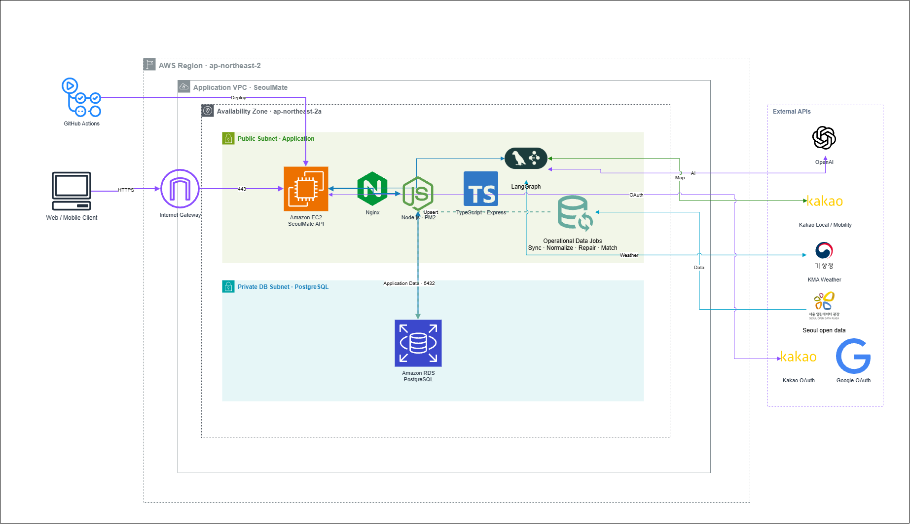

# SeoulMate

> 자연어 요청을 실제 방문 가능한 서울 데이트 코스로 변환하는 데이터 기반 AI 추천 서비스



SeoulMate는 사용자가 “오늘 저녁 성수에서 4만 원 이하로 조용한 데이트 코스를 추천해줘”처럼 자연어로 조건을 입력하면, 서울시 공공데이터에 등재된 실제 장소를 조합해 이동 동선까지 고려한 코스를 추천합니다.

LLM은 자연어 조건 구조화와 결과 설명에 사용하고, 장소 선택은 PostgreSQL 후보 데이터와 Kakao 검증, 날씨·혼잡도·거리·예산을 반영한 결정론적 scoring으로 수행합니다. 이를 통해 존재하지 않는 장소를 추천하는 hallucination을 줄이고 추천 근거를 추적할 수 있도록 설계했습니다.

## 핵심 기능

- 로컬·Kakao·Google 인증과 JWT refresh token rotation
- 자연어 기반 서울 데이트 코스 추천
- 실제 장소 후보 조회 및 Kakao Local 교차 검증
- 예산·분위기·혼잡도·날씨·거리·안전·목적 기반 scoring
- `best`, `balanced`, `indoor`, `low-budget`, `mood-*` 코스 variant 생성
- 서울시 공공데이터 수집·정규화·좌표 복구·Kakao URL matching
- 추천 결과와 장소·가격·날씨 snapshot 저장
- GitHub Actions 기반 EC2 자동 배포

## 기술 스택

| 영역           | 기술                                              |
| -------------- | ------------------------------------------------- |
| Runtime        | Node.js 20, TypeScript                            |
| Framework      | Express 5                                         |
| AI             | LangGraph, OpenAI structured output               |
| Database       | PostgreSQL 16, AWS RDS                            |
| External API   | Kakao Local/Mobility, 기상청, 서울 열린데이터광장 |
| Authentication | JWT, HttpOnly Cookie, Kakao/Google OAuth          |
| Infrastructure | AWS EC2, VPC, RDS, Nginx, PM2                     |
| CI/CD          | GitHub Actions, SSH deployment                    |

## 시스템 아키텍처

현재 운영 환경은 초기 서비스 규모와 비용을 고려한 `EC2 + Nginx + PM2 + RDS PostgreSQL` 구성입니다.

```text
Web / Mobile Client
  -> HTTPS 443
  -> Internet Gateway
  -> Nginx on EC2
  -> PM2
  -> Express API (127.0.0.1:3000)
       -> LangGraph recommendation workflow
       -> Operational data jobs
       -> OpenAI / Kakao / KMA / Seoul Open Data
       -> RDS PostgreSQL (private subnet, 5432)

GitHub main push
  -> GitHub Actions
  -> EC2 SSH
  -> install / build
  -> PM2 reload
```

애플리케이션 EC2는 `ap-northeast-2a` public subnet에 배치하고, RDS는 외부에서 직접 접근할 수 없는 private DB subnet에 배치했습니다. DB subnet group은 `ap-northeast-2a`, `ap-northeast-2c`를 포함하지만 현재 EC2와 RDS 실행 구성은 Single-AZ입니다.

Nginx는 HTTPS termination과 reverse proxy를 담당하며 Express의 3000 포트는 외부에 공개하지 않습니다. PM2는 Node.js 프로세스 재시작, 로그, 서버 재부팅 후 복구와 배포 시 reload를 담당합니다.

자세한 구성과 선택 근거는 [인프라 아키텍처 문서](SeoulMate_BE/docs/INFRASTRUCTURE.md)를 참고하세요.

## LangGraph 추천 흐름

```text
START
  -> parseUserRequest
  -> fetchCandidatePlaces
  -> verifyCandidatePlaces
  -> fetchContextData
  -> scorePlaces
  -> buildCourse
  -> validateRecommendation
  -> buildAlternativeCourse
  -> validateRecommendationFinal
  -> generateAiExplanation
  -> generateRiskNotice
  -> formatRecommendationResult
  -> END
```

LangGraph의 typed shared state에 자연어 해석 결과, 장소 후보, 날씨·혼잡도·경로 context, 점수, 코스, 검증 결과와 warning을 누적합니다. LLM 호출에 실패하면 heuristic parser와 template 설명을 사용하고, Kakao Mobility 호출에 실패하면 좌표 기반 거리 추정으로 대체합니다.

OpenAI는 다음 두 영역에만 관여합니다.

1. 자연어 요청을 지역·예산·시간·분위기·목적·카테고리로 구조화
2. 이미 확정된 실제 장소 코스의 설명 생성

장소 존재 여부, 후보 조회, 점수 계산, 예산, 이동 순서와 validation은 데이터베이스와 애플리케이션 코드가 결정합니다.

상세한 추천 설계는 [AI 코스 추천 문서](SeoulMate_BE/docs/AI_COURSE_RECOMMENDATION.md)를 참고하세요.

## 정량 검증

```bash
cd SeoulMate_BE
npm test
npm run benchmark:db:setup
npm run benchmark:direct
```

- 결정론적 추천 규칙 자동 테스트: **37/37 통과**
- TypeScript build: 성공
- ESLint: error 0건
- 서버 없는 Direct LangGraph benchmark: **20/20 성공**, validation·예산·시간·DB 실재성·추천 좌표·지역 alias 일치율 **모두 100%**
- 로컬 PostgreSQL 데이터: **172,821개 장소 / 9개 데이터셋**, category 정규화율 **100%**, 좌표 보유율 **98.84%**
- 최적화 후 20개 시나리오 처리시간: 평균 **1,245ms**, p50 **1,215ms**, p95 **1,415ms**
- warm-up 5회 + 동일 조건 40회 전후 비교: 평균 latency **27.19% 감소**, p95 **45.91% 감소**, 순차 처리량 **37.38% 증가**
- 대표 후보 조회의 SQL 10→1개, plan scan tuple **61.58% 감소** (`EXPLAIN ANALYZE BUFFERS`)
- 재현 가능한 원본 결과: [`direct-local.json`](SeoulMate_BE/reports/benchmark/direct-local.json), [`direct-local.md`](SeoulMate_BE/reports/benchmark/direct-local.md)

지표 계산식과 실행 조건은 [정량 검증 문서](SeoulMate_BE/docs/BENCHMARK.md)를 참고하세요.

## 프로젝트 구조

```text
SeoulMate/
├── .github/workflows/       # GitHub Actions 배포
├── docs/assets/             # 아키텍처 다이어그램
├── SeoulMate_BE/
│   ├── src/
│   │   ├── clients/         # 외부 API adapter
│   │   ├── controllers/     # HTTP request/response
│   │   ├── graphs/          # LangGraph state와 node
│   │   ├── jobs/            # 데이터 수집·정규화 batch
│   │   ├── repositories/    # PostgreSQL 접근
│   │   ├── routes/          # endpoint와 middleware
│   │   └── services/        # domain logic
│   └── docs/                # API, DB, 인프라 문서
├── PORTFOLIO.md
└── README.md
```

## 로컬 실행

요구 사항:

- Node.js 20 이상
- PostgreSQL 16 이상

```bash
cd SeoulMate_BE
npm install
cp .env.example .env
npm run dev
```

서버는 기본적으로 `http://localhost:3000`에서 실행됩니다.

```bash
curl http://localhost:3000/health
```

운영 secret과 API key는 저장소에 포함하지 않습니다. 필요한 환경 변수는 [`.env.example`](SeoulMate_BE/.env.example)을 참고하세요.

## 주요 명령어

### 개발과 검증

```bash
npm run dev
npm run build
npm run lint
npm run format:check
```

### 공공데이터 pipeline

```bash
npm run sync:public-data
npm run normalize:categories
npm run repair:coordinates
npm run normalize:kakao-categories
npm run match:kakao-urls
npm run sync:weather
npm run sync:living-population
```

## 배포

`main` 브랜치에 push하면 GitHub Actions가 EC2에 SSH로 접속해 코드를 동기화하고 TypeScript를 빌드한 뒤 PM2 프로세스를 reload합니다.

```text
push(main)
  -> SSH to EC2
  -> git sync
  -> npm install
  -> npm run build
  -> pm2 reload seoulmate-be
```

## 문서

| 문서                                                               | 설명                                     |
| ------------------------------------------------------------------ | ---------------------------------------- |
| [Portfolio](PORTFOLIO.md)                                          | 문제 정의, 기여, LangGraph와 인프라 설계 |
| [Infrastructure](SeoulMate_BE/docs/INFRASTRUCTURE.md)              | AWS 네트워크, Nginx, PM2, RDS, CI/CD     |
| [Benchmark](SeoulMate_BE/docs/BENCHMARK.md)                        | 자동 테스트와 E2E 정량 평가              |
| [Performance](SeoulMate_BE/docs/PERFORMANCE.md)                    | 노드·SQL 병목과 최적화 전후 실측         |
| [AI Recommendation](SeoulMate_BE/docs/AI_COURSE_RECOMMENDATION.md) | 추천 graph, scoring, variant, fallback   |
| [API](SeoulMate_BE/docs/API.md)                                    | API endpoint와 request/response          |
| [Database](SeoulMate_BE/docs/DATABASE.md)                          | PostgreSQL schema와 table 역할           |
| [Deployment](SeoulMate_BE/docs/DEPLOYMENT.md)                      | EC2/RDS 배포와 운영 절차                 |
| [Security Groups](SeoulMate_BE/docs/AWS_SECURITY_GROUPS.md)        | 포트와 접근 정책                         |
